TODO:

- Mono, Stereo modes
- Low pass, band pass, high pass

### 如何加 Effect

比如要加一个 "Echo2" 的效果

#### 首先修改 UI

 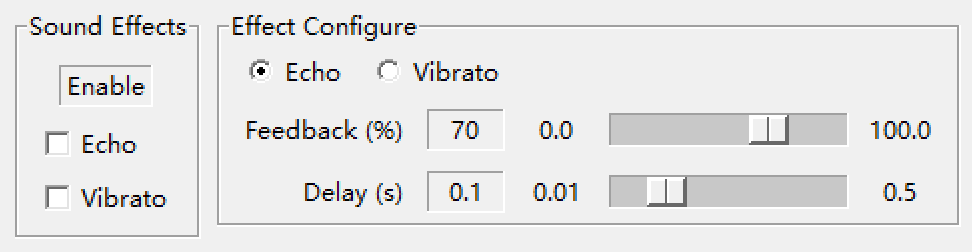

1）**Sound Effects** 里加上 Echo2 的开关

在 `view.py` 里，找到 120 行，在下面加上开关的变量

 

然后复制 139 ~ 145 行的内容

  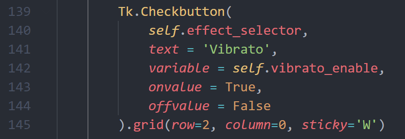

在后面粘贴上下面的内容，不同之处用红框标起来了

  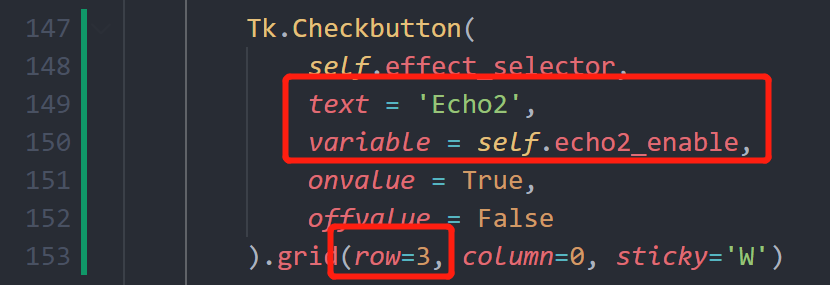

到此为止保存运行，效果如下：

   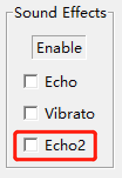

2）**Effect Configure** 里加上 AM 的选项和 slider 设置

**一、**在 `view.py` 中找到 205 ~ 211 行，复制

 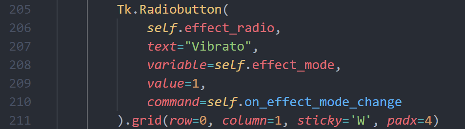

在后面粘贴，不同之处用红框标出：

  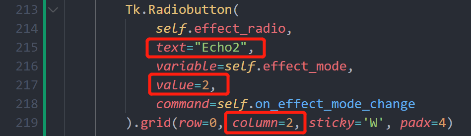

（value 和 column 都要 +1）

**二、**在 `view.py` 找到 228 ~ 241 行，复制

 

然后在下面粘贴，红框是固定格式的不同之处，绿框是根据 effect 的情况进行修改

  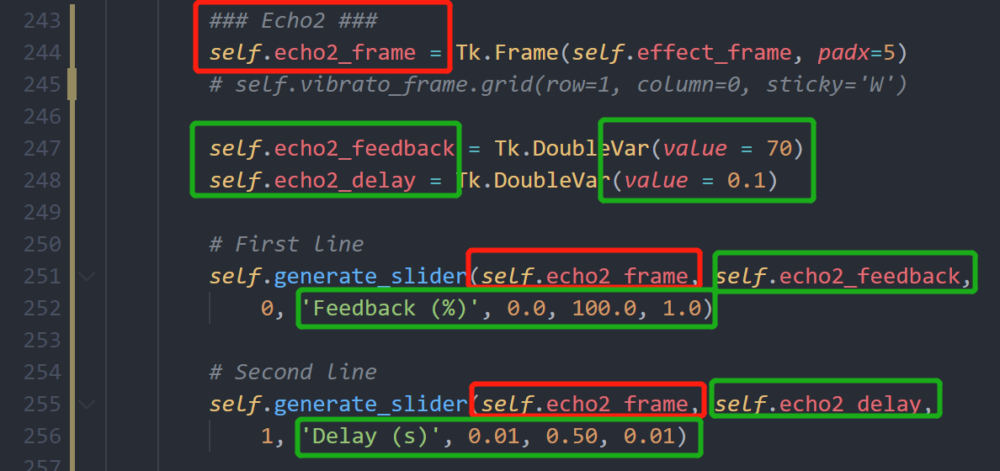

其中：

- 247，248 左边的绿框变量受 UI 中的 slider 控制，根据 Effect 实际会变化的变量命名
  - 比如 Echo 的公式是 y(n) = x(n) + G * x(n - N)，Feedback 就是 G，delay 控制 N
  - 247，248 右边的绿框是两个变量的初始值
- 251，255 两行实际上是在 UI 中生成两行 slider：
  -  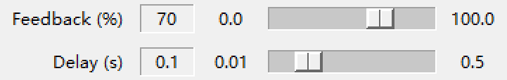
  - 251，255 的绿框是将变量绑定到 slider 上，从而 slider 滑动时变量也会变
  - 以 252 的绿框为例：
    - 最左边的字符串直接在 UI 上显示
    - 从左到右三个数字分别是：最小值，最大值，滑块滑动精度（最小变化值）

最后，在刚刚粘贴的代码后面找到一个 `self.frames` 变量，加上刚刚的 `echo2_frame`

保存，运行，效果如下：

 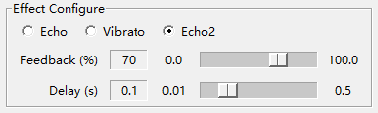

到这一步 UI 已经完成了，但是可以发现 Effect 还没起作用

#### UI 改好后，加 Effect 的实现

大概就是在 effects 目录下加一个 `echo2.py`，可以复制 `echo.py` 在其基础上改

 

要注意的是，Class 要继承 Effect

  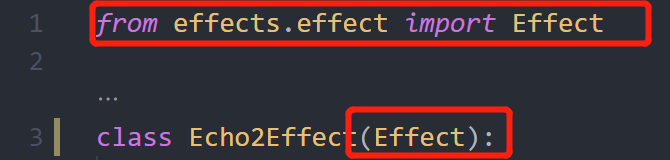

然后关键就是 `apply` 这个函数

- 输入 input_tuple，得到 output_tuple
- 和作业写过的东西差不多

 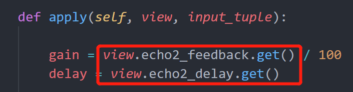

注意这里的 `view.echo2_feedback` 和 `view.echo2_delay`，实际上就是上一步修改 UI 时加的两个变量，对应 slider 的值，在这里可以拿到

然后就是用这两个变量和 `input_tuple` 得到 output

 

注意这里不是输出最终值，而是输出最终值和初始值的差值，因此减去了 x0

- 因为最终需要重叠多个 effect 的效果，所以这里只算差值，之后将所有 effect 得到的差值加到原信号上面即可

apply 函数 return 的是 diff_block

最后，在 `app.py` 里加上 effect

一、import

 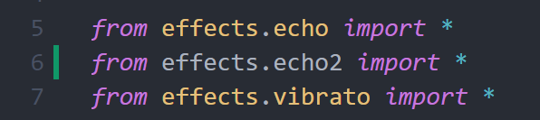

二、在 `set_rate()` 里加上 effect

 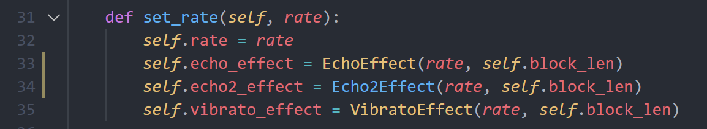

三、在 `start()` 函数中找到这几行，复制粘贴

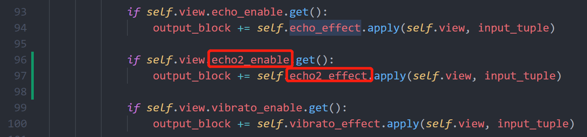

到这里就真正实现了 effect 的添加

